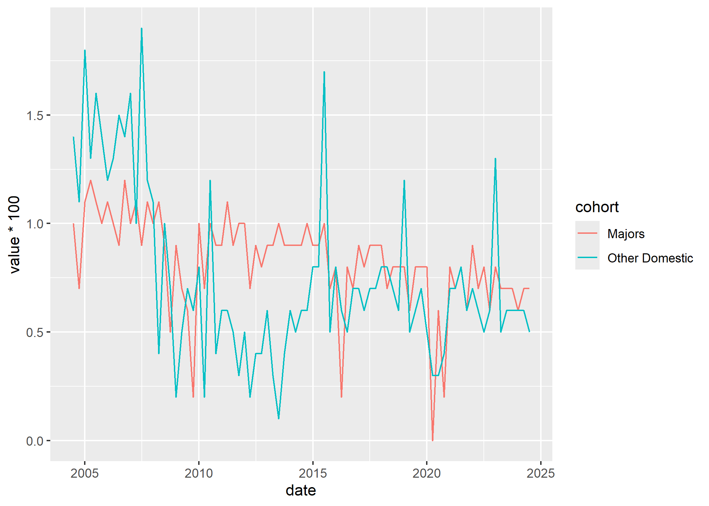

<!-- README.md is generated from README.Rmd. Please edit that file -->

# readapra 

<!-- badges: start -->

[](https://app.codecov.io/gh/javanderwal/readapra)
<!-- badges: end -->

The R package *readapra* provides a series of function to easily scrape
data from the [Australian Prudential Regulation Authority’s
(APRA)](https://www.apra.gov.au/) statistical publications and return
them as a [tibble](https://tibble.tidyverse.org/) object.

## Installation

You can install the development version from GitHub using the
[*remotes*](https://remotes.r-lib.org/) package:

``` r
remotes::install_github("javanderwal/readapra")
```

## Features

Currently the *readapra* package only contains functions related to the
scraping of Authorised Deposit- taking Institution (ADI) statistical
publications produced by APRA. The intention is to have future versions
of *readapra* also be able to scrape Insurance and Superannuation
statistical publications produced by APRA.

#### ADI statistical publications

The following ADI statistical publications can be scraped using
*readapra*:

- [Quarterly Authorised Deposit-taking Institution Performance
  Statistics
  (QADIPS)](https://www.apra.gov.au/quarterly-authorised-deposit-taking-institution-statistics)

- [Quarterly Authorised Deposit-taking Institution Centralised
  Publication
  (QADICP)](https://www.apra.gov.au/quarterly-authorised-deposit-taking-institution-statistics)

- [Quarterly Authorised Deposit-taking Institution Property Exposures
  Statistics
  (QADIPEXS)](https://www.apra.gov.au/quarterly-authorised-deposit-taking-institution-statistics)
  (Both the current and historic series)

- [Monthly Authorised Deposit- taking Institution Statistics
  (MADIS)](https://www.apra.gov.au/monthly-authorised-deposit-taking-institution-statistics)
  (Both the current and historic series)

- [Authorised Deposit-taking Institution Points of Presence Statistics
  (ADIPOPS)](https://www.apra.gov.au/authorised-deposit-taking-institutions-points-of-presence-statistics)

## Example

Using the *readapra* package it is extremely easy to download and import
APRA’s statistical publication data into R. This allows for the easy
visualisation of the data using packages such as ggplot2.

``` r
library(readapra)
library(ggplot2)
library(dplyr)
```

First we extract the Quarterly Authorised Deposit-taking Institution
Performance Statistics (QADIPS) data using the `read_qadips` function:

``` r
qadips_data <- read_qadips()
```

We then clean up the data a bit further using some functions from
*dplyr*:

``` r
roa_data <- 
  filter(
  .data = qadips_data,
  series == "Return on assets (after tax)", 
  sheet %in% c("Tab 4f", "Tab 5g"), 
  !is.na(value)
  )

roa_data_cohorts <- 
  mutate(
    .data = roa_data, 
    cohort = 
      case_when(
      sheet == "Tab 4f" ~ "Majors", 
      .default = "Other Domestic")
    )
```

And then finally we can plot the data, showing return on assets for the
Major Australian Banks and Other Domestic Australian Banks:

``` r
ggplot(data = roa_data_cohorts, aes(date, value * 100, colour = cohort)) + 
  geom_line()
```



## Disclaimer

This package is not affiliated with or endorsed by the Australian
Prudential Regulation Authority (APRA). All data is provided subject to
any conditions and restrictions set out on the APRA website.
