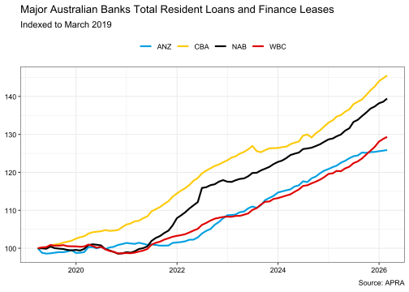

<!-- README.md is generated from README.Rmd. Please edit that file -->


<!-- badges: start -->

[](https://app.codecov.io/gh/javanderwal/readapra)
[](https://github.com/javanderwal/readapra/actions/workflows/R-CMD-check.yaml)
<!-- badges: end -->

The R package `readapra` provides a series of function to download and
import data from the [Australian Prudential Regulation Authority’s
(APRA)](https://www.apra.gov.au/) statistical publications and return
them as a [tibble](https://tibble.tidyverse.org/) object.

## Installation

You can install `readapra` from CRAN using:

``` r
install.packages("readapra")
```

Or you can install the development version from GitHub using the
[`remotes`](https://remotes.r-lib.org/) package:

``` r
remotes::install_github("javanderwal/readapra")
```

## Features

The `readapra` package facilitates the downloading and importing of
statistical publications published by APRA. The package also allows for
the importing of data from locally saved statistical publication files.

Currently the `readapra` package only supports the downloading and
importing of Authorised Deposit-taking Institution (ADI) statistical
publications. The intention is for future versions of `readapra` to also
accommodate APRA’s general insurance, life insurance and friendly
societies, private health insurance and superannuation statistical
publications.

#### ADI statistical publications

The following ADI statistical publications can be downloaded and
imported with `readapra`:

- [Quarterly Authorised Deposit-taking Institution Performance
  Statistics
  (QADIPS)](https://www.apra.gov.au/quarterly-authorised-deposit-taking-institution-statistics)

- [Quarterly Authorised Deposit-taking Institution Centralised
  Publication
  (QADICP)](https://www.apra.gov.au/quarterly-authorised-deposit-taking-institution-statistics)

- [Quarterly Authorised Deposit-taking Institution Property Exposures
  Statistics
  (QADIPEXS)](https://www.apra.gov.au/quarterly-authorised-deposit-taking-institution-statistics)
  (both the current and historic series)

- [Monthly Authorised Deposit- taking Institution Statistics
  (MADIS)](https://www.apra.gov.au/monthly-authorised-deposit-taking-institution-statistics)
  (both the current and historic series)

- [Authorised Deposit-taking Institution Points of Presence Statistics
  (ADIPOPS)](https://www.apra.gov.au/authorised-deposit-taking-institutions-points-of-presence-statistics)

## Example

The ability to download and import APRA’s statistical publications with
`readapra` greatly eases the analysis and visualisation of this data via
packages such as `ggplot2`.

The following example demonstrates the plotting of total resident assets
on a monthly basis for Australia’s four major banks.

We start by first librarying the required packages:

``` r
library(readapra)
library(tidyverse)
```

We then download and import the Monthly Authorised Deposit-taking
Institution Statistics (MADIS) data using the `read_apra()` function:

``` r
madis_data <- read_apra(stat_pub = "madis", cur_hist = "current")
```

We then filter and clean-up the desired data like so:

``` r
major_bank_assets <- 
  madis_data %>%
  filter(
    abn %in% c(48123123124, 33007457141, 12004044937, 11005357522),
    series == "Total residents loans and finance leases"
  ) %>%
  mutate(
    short_name = dplyr::case_when(
      abn == 48123123124 ~ "CBA",
      abn == 33007457141 ~ "WBC",
      abn == 12004044937 ~ "NAB",
      abn == 11005357522 ~ "ANZ",
    )
  ) %>%
  group_by(short_name) %>%
  mutate(value = 100 * value / first(value)) %>%
  ungroup()
```

And then finally we can plot the data using `ggplot2`:

``` r
ggplot(
  data = major_bank_assets,
  mapping = aes(date, value, colour = short_name)
) +
  geom_line(linewidth = 1) +
  labs(
    title = "Major Australian Banks Total Resident Loans and Finance Leases",
    subtitle = "Indexed to March 2019",
    caption = "Source: APRA"
  ) +
  theme_bw() +
  theme(
    legend.position = "top",
    legend.title = element_blank(),
    axis.title = element_blank(),
    axis.text = element_text(colour = "black")
  ) +
  scale_colour_manual(values = c(
    "CBA" = "#FECA0A",
    "WBC" = "#DF0000",
    "NAB" = "#000000",
    "ANZ" = "#009FE1"
  ))
```



## Managing Network Connections

Corporate networks, especially those using Virtual Private Networks
(VPNs), may restrict the ability to download files within an R session.
A possible fix for this is to utilise the the `"wininet"` method for
downloading files. Users can specify the `"wininet"` method (or any
other download method) for `readapra` to use by setting the
`"R_READAPRA_DL_METHOD"` environment variable.

To set the `"R_READAPRA_DL_METHOD"` environment variable to `"wininet"`
for your current session, use the following code:

``` r
Sys.setenv("R_READAPRA_DL_METHOD" = "wininet")
```

You can add `"R_READAPRA_DL_METHOD" = "wininet"` to your `.Renviron`
file to ensure this download setting persists across R sessions. You can
conveniently access and edit your `.Renviron` file with the
[`usethis`](https://usethis.r-lib.org/) package:

``` r
usethis::edit_r_environ()
```

## Disclaimer

This package is not affiliated with or endorsed by the Australian
Prudential Regulation Authority (APRA). All data is provided subject to
any conditions and restrictions set out on the APRA website.
